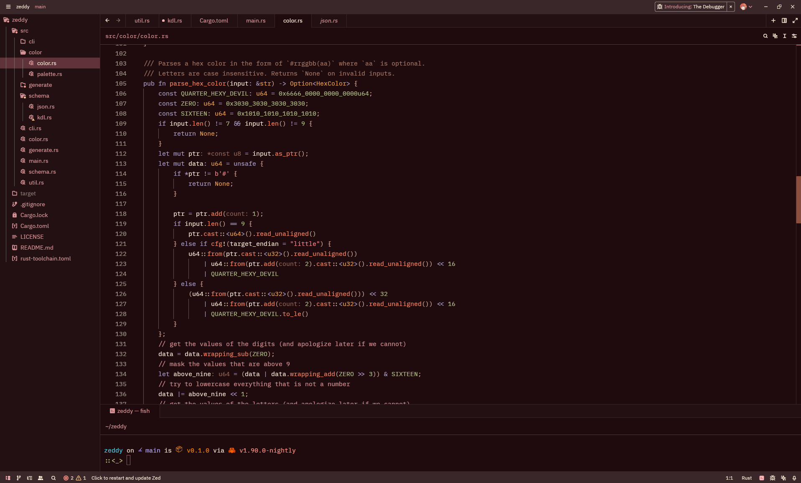
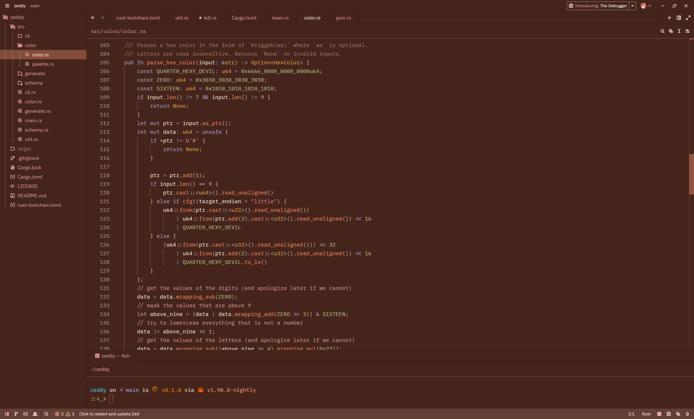

# Autumnal Marscape: A pink and orange theme for Zed
Feel immersed in the Martian landscape with this festive red, pink and orange dark set of Zed themes.

Available variants: \[Starlight, Dust Storm\]

## Info
This theme is a showcase of my theme tool [`zeddy`](https://github.com/lilyyy411/zeddy).
The theme is built around the idea of basing everything on transformations on a single base color,
preserving at least one property (luminance, chroma, or hue) of the base color whenever possible.
This allows me to reap the benefits of LCH's perceptual uniformity
while barely having to think about whether the colors actually work.

## Showcase
### Autumnal Marscape Starlight

### Autumnal Marscape Dust Storm


## Contributing
Contributing requires my tool [`zeddy`](https://github.com/lilyyy411/zeddy). You should *only* directly
edit the `autumnal-marscape.kdl` file. Before committing, make sure `./themes/autumnal-marscape.json` is updated.

A basic hot swap loop may look like
```sh
zeddy ./autumnal-marscape.kdl --outfile ./themes/autumnal-marscape.json watch
```
